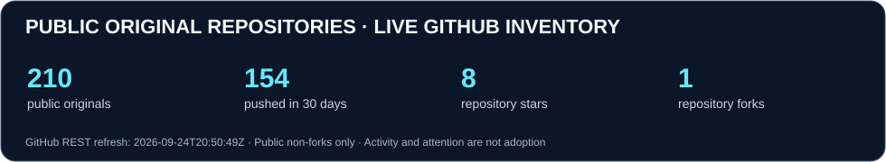
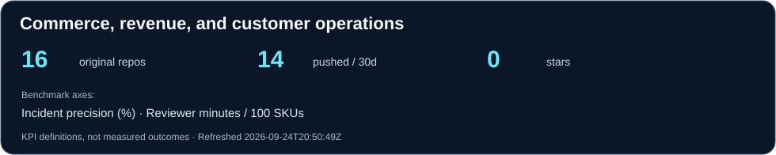
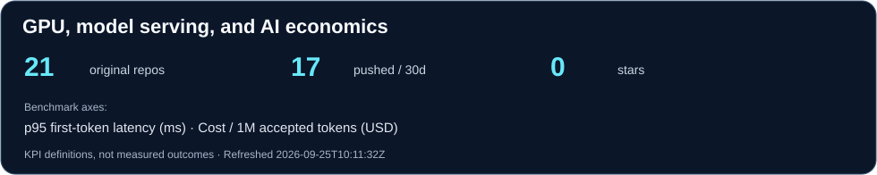
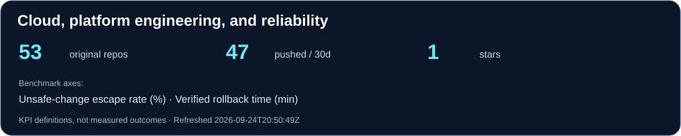
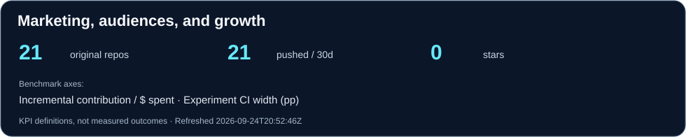
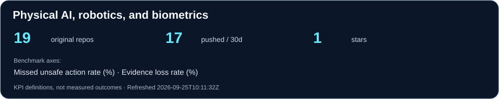
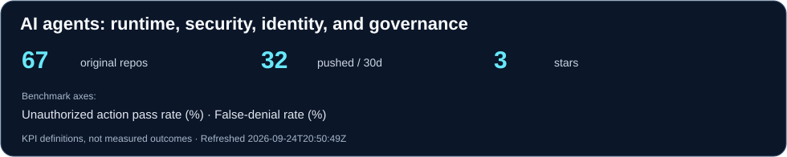
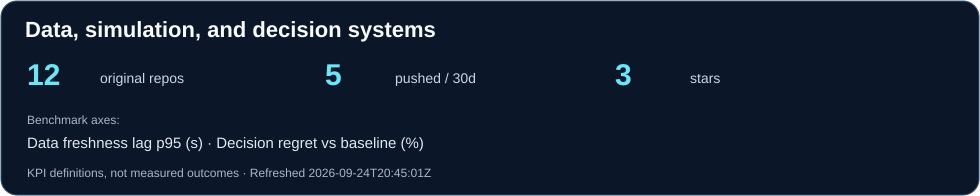

# Ahmed Hassan · Inspectable systems across infrastructure, intelligence, and operations with the Apex of International Standards and GRC

I build distinct open-source systems for cloud and network operations, GPU/model economics, agent security and identity, commerce operations, physical AI, data/decision systems, and marketing measurement. Each domain has its own technical objective, benchmark units, and evidence boundary.

[Browse every public original repository](PORTFOLIO.md) · [Read the benchmark protocols](BENCHMARKS.md) · [LinkedIn](https://www.linkedin.com/in/ahmed-hassan-f11/)

## Live GitHub portfolio telemetry



The cards below refresh daily from GitHub's public repository API. Counts exclude forks and private repositories. A push is repository activity, not a deployment or customer adoption. Stars and forks are GitHub attention, not revenue or independent validation. [Inspect the machine-readable snapshot and definitions](data/profile-metrics.json).

## Engineering domains and benchmark axes

These are **separate domains**, not one blended product category. Each card links to that domain's original projects. Its two benchmark labels specify what to measure; they are **not claimed results**. The [protocol](BENCHMARKS.md) defines the numerator, denominator, workload, and evidence needed before publishing a score.

[](PORTFOLIO.md#commerce-revenue-and-customer-operations)

Commerce systems reconcile product, order, payment, and customer-operation states. Their tests should measure incident precision and human review effort, not equate detected mismatches with recovered revenue. [Commerce Incident Network](https://github.com/AAH20/commerce-incident-network) · [Merchant Profit OS](https://github.com/AAH20/merchant-profit-os).

[](PORTFOLIO.md#gpu-model-serving-and-ai-economics)

Model-serving work is about latency, throughput, capacity, and unit cost under a declared workload. [LLM Inference Benchmark](https://github.com/AAH20/llm-inference-benchmark) · [GPU Cloud Cost Calculator](https://github.com/AAH20/gpu-cloud-cost-calculator).

[](PORTFOLIO.md#cloud-platform-engineering-and-reliability)

Cloud and network engineering is evaluated on change safety, blast radius, rollback, and operational reliability. [Multi-Cloud Infrastructure Control Loop](https://github.com/AAH20/multicloud-infrastructure-control-loop) · [Network Change Intelligence Twin](https://github.com/AAH20/network-change-intelligence-twin).

[](PORTFOLIO.md#marketing-audiences-and-growth)

Marketing systems require causal measurement and decision quality, not impressions or synthetic engagement as a substitute for business outcomes. [AttentionOS Bench](https://github.com/AAH20/attentionos-bench) · [Audience Swarm Lab](https://github.com/AAH20/audience-swarm-lab).

[](PORTFOLIO.md#physical-ai-robotics-and-biometrics)

Physical AI is evaluated on unsafe-action misses, recorder completeness, reproducibility, and safe failure under defined conditions. [Physical AI Governor](https://github.com/AAH20/physical-ai-governor) · [Robot Black Box](https://github.com/AAH20/robot-black-box).

[](PORTFOLIO.md#ai-agents-runtime-security-identity-and-governance)

Agent systems are evaluated on authorized execution, denied-action escape, false denial, and evidence integrity. [GRC Claw](https://github.com/AAH20/GRC_Claw) · [Agent Trust Fabric](https://github.com/AAH20/agent-trust-fabric).

[](PORTFOLIO.md#data-simulation-and-decision-systems)

Data and decision systems are evaluated on freshness, correctness, and decision improvement against a fixed baseline. [Decision World](https://github.com/AAH20/decision-world) · [Outcome Fabric](https://github.com/AAH20/outcome-fabric).

The [remaining profile repository](PORTFOLIO.md#other-original-projects) is listed separately. Domain counts are classification metadata, not a ranking of technical maturity.

## Selected implementations and evidence boundaries

| System | Painful business problem | Executable proof | Evidence boundary |
|---|---|---|---|
| [Commerce Incident Network](https://github.com/AAH20/commerce-incident-network) | Shopify and Google Merchant Center can disagree about product visibility, price, and availability | Offline two-snapshot demo, incident queue, local operator desk, and verifier | Fictional fixtures; read-only connectors tested with mocked responses; no live merchant account exercised |
| [Multi-Cloud Infrastructure Control Loop](https://github.com/AAH20/multicloud-infrastructure-control-loop) | Cloud findings rarely explain the safe change, financial impact or verification path | Five Azure/AWS/GCP/Kubernetes workflows, cost scenarios, blast-radius gates and verification receipts | Seven tests; synthetic fixtures; performs no production mutation |
| [Network Change Intelligence Twin](https://github.com/AAH20/network-change-intelligence-twin) | A network change can interrupt every dependent workload and revenue path | Intent validation, path analysis, dependency-failure replay, policy gates and revenue exposure | Implemented and simulated; Bicep compiled; no production device operated |
| [Kubernetes AI FinOps Autopilot](https://github.com/AAH20/kubernetes-ai-finops-autopilot) | GPU and inference workloads scale cost faster than successful business outcomes | Policy-qualified cost models, admissibility gates and reviewable GitOps proposals | Reproducible synthetic scenarios; no silent cluster mutation |
| [GRC Claw](https://github.com/AAH20/GRC_Claw) | Enterprises need governed agentic systems, not unbounded agents attached to sensitive tools | ISO 42001-oriented governance chassis, agent controls, MCP boundaries and compliance workflows | OSS implementation; framework mappings require organizational and auditor validation |

## Multi-cloud evidence and remediation suite

The control loop consumes normalized operational evidence from three independently testable cloud adapters:

- [Azure Compliance Automation](https://github.com/AAH20/ciso-assistant-azure-compliance-automation) — Azure Policy and Checkov/Terraform evidence.
- [AWS Compliance Automation](https://github.com/AAH20/ciso-assistant-aws-compliance-automation) — Security Hub, AWS Config and Checkov/Terraform evidence.
- [GCP Compliance Automation](https://github.com/AAH20/ciso-assistant-gcp-compliance-automation) — Security Command Center, Cloud Asset Inventory and Checkov/Terraform evidence.

Each adapter produces normalized control observations, SHA-256 integrity digests and review-gated CISO Assistant synchronization plans. CISO Assistant remains the GRC system of record; the adapters and control loop provide the technical collection, architecture decision and verification layers.

## How to evaluate the work

- **Commerce:** adjudicated incident precision, review effort, correction observation, and contribution economics.
- **GPU/model serving:** latency and throughput at fixed quality, concurrency, model revision, and fully allocated cost.
- **Cloud/network:** unsafe-change escapes, blast-radius prediction, rollback verification, and recovery time.
- **Marketing:** incrementality and uncertainty under a declared experimental design.
- **Physical AI:** missed hazards, decision timing, recorder completeness, and safe failure in a specified environment.
- **Agent security/identity:** prohibited-action escapes, false denials, policy scope, and replayable traces.
- **Data/decisions:** data freshness, correctness, baseline utility, and outcome observation.

[See exact benchmark definitions and evidence requirements](BENCHMARKS.md).

## CISO and GRC expertise

I treat governance as an engineering feedback loop derived from deployed systems—not a spreadsheet layer separated from operations:

```text
Cloud, network, identity, application and SOC telemetry
                         ↓
           Normalized technical evidence
                         ↓
     Controls, risks, findings and audit workflows
                         ↓
   Terraform / OpenTofu / Bicep / Ansible proposal
                         ↓
         Human approval and controlled rollout
                         ↓
       Recollection and remediation verification
```

Relevant capabilities include:

- CISO Assistant integration and multi-cloud evidence collection;
- ISO 27001, ISO 42001, SOC 2, NIST, CIS, NIS2 and DORA mapping workflows;
- Microsoft Sentinel, Wazuh, OpenSearch and cloud-native SOC architectures;
- identity, segmentation, logging, detection engineering and incident evidence;
- audit readiness, evidence lifecycle, third-party risk and corrective-action tracking;
- agent authorization, MCP security and human-governed remediation.

Framework mappings and modeled outcomes are never presented as certification, legal advice or customer results without the corresponding review and evidence.

## Proof matrix

| Project | Automated proof | Live deployment claim | Synthetic evidence | Mutation boundary |
|---|---:|---|---|---|
| Multi-Cloud Infrastructure Control Loop | 7 tests | No | Yes | Offline; proposals only |
| Azure Compliance Bridge | 4 tests | No | Yes | Remote API sync requires explicit `--apply` |
| AWS Compliance Bridge | 5 tests | No | Yes | Remote API sync requires explicit `--apply` |
| GCP Compliance Bridge | 4 tests | No | Yes | Remote API sync requires explicit `--apply` |
| [Azure Private Link Doctor](https://github.com/AAH20/azure-private-link-doctor) | Reproducible scenario suite | No | Yes | Diagnostics and IaC scaffolds only |
| Kubernetes AI FinOps Autopilot | Reproducible scenario suite | No | Yes | Reviewable GitOps proposals only |

## Evidence standard

Every flagship separates four evidence classes:

- **Implemented** — executable code and automated tests exist.
- **Deployed** — retained evidence comes from an authorized cloud or infrastructure environment.
- **Simulated** — deterministic fixtures or synthetic telemetry exercise declared scenarios.
- **Contract** — an integration boundary is designed but has not called the real provider.

Modeled revenue, savings, latency, capacity and risk reduction are not presented as customer outcomes. SHA-256 receipts demonstrate integrity of serialized decisions; they do not provide non-repudiation without authenticated signing and evidence custody.

## Supporting platforms

- [Agentic DevOps & SRE Skill Registry](https://github.com/AAH20/agentic-devops-sre-skill-registry) — evaluated reusable skills for CloudOps, SRE, Kubernetes, networking and FinOps.
- [AI Factory Revenue Twin](https://github.com/AAH20/ai-factory-revenue-twin) — GPU, fabric, capacity and hybrid-cloud unit economics.
- [Enterprise AI Integration Platform](https://github.com/AAH20/enterprise-ai-integration-platform) — durable orchestration across CRM, ERP, payments, logistics and billing boundaries.
- [AI-Native Internal Developer Platform](https://github.com/AAH20/ai-native-internal-developer-platform) — Kubernetes, GitOps, golden paths and platform delivery economics.
- [AIOps Observability Platform](https://github.com/AAH20/aiops-observability-platform) — OpenTelemetry, root-cause analysis and incident automation.
- [Cloud Resilience & Disaster Recovery](https://github.com/AAH20/cloud-resilience-disaster-recovery-platform) — RTO/RPO, ransomware recovery and multi-region scenarios.

Post-quantum, healthcare, biometric, robotics, and domain-specific systems retain their own scope and evidence limits in the [full original-project directory](PORTFOLIO.md).

## Engagements

### Infrastructure and model-serving architecture

Cloud, network, Kubernetes, GPU serving and data topology; failure modes, capacity, rollback, security boundaries, operating KPIs, and unit economics.

### Identity, agent security, and governed operations

Authorization boundaries, agent-tool evaluation, SOC integration, control evidence, and reviewable remediation workflows.

### Commerce, marketing, and decision systems

Product and order-state diagnostics, causal measurement, customer-operation reliability, data freshness, and benchmark design tied to accepted business outcomes.

### Physical AI and high-consequence evaluation

Recorder completeness, missed-hazard evaluation, simulation-to-lab evidence boundaries, and safety-oriented test protocols.

For a scoped technical review, [contact me through A2Z SOC](https://a2zsoc.com/contact?topic=architecture-review&utm_source=github&utm_medium=profile). A2Z SOC is a separate services site; the repositories and benchmark specifications above are the open-source work.
