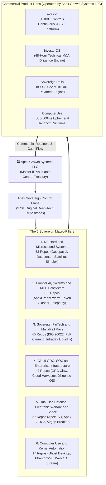

# Ahmed Hassan

  <b>Founder & Sole Managing Member, <a href="https://github.com/AAH20/apex-sovereign-launchpad">Apex Growth Systems LLC</a></b> 
  <i>Combinatorial Optimization · Microsecond Operations Research · Frontier AI Swarms · Sovereign FinTech · Enterprise GRC</i>

  
  
  
  

---

### 🌐 Live Portfolio Telemetry

  

  
  

  

---

## 🏛️ Featured Sovereign Flagships

The six core systems highlighted below represent deep-tech infrastructure, command-and-control operations, and governed agent intelligence incubated under **Apex Growth Systems LLC**:

| Repository | Primary Architecture & Focus | Evidence Standard | Core Capabilities |
| :--- | :--- | :---: | :--- |
| **[GRC Claw](https://github.com/AAH20/GRC_Claw)** | **AI Agent Governance & Delegated Authority Chassis** | `Implemented` | ISO 42001 & NIST AI RMF governance chassis, agent tool authorization, Model Context Protocol (MCP) policy boundaries, and audit trail ledgers. |
| **[ApexGraphSwarm](https://github.com/AAH20/ApexGraphSwarm)** | **Local-First Graph Intelligence & Multi-Agent Swarm Workbench** | `Implemented` | In-memory graph reasoning, GraphRAG multi-hop traversal, specialist swarm delegation, and cost-aware cognitive load arbitration. |
| **[Data Center Commander](https://github.com/AAH20/data-center-commander)** | **Mission-Critical Datacenter Decision Support** | `Simulated` | Thermal dynamics, power ride-through, N-1 capacity reservation, PUE optimization, and zero-actuation read-only evidence pipelines. |
| **[Agentic IoT Command](https://github.com/AAH20/agentic-iot-command)** | **Governed Operational Technology (OT) & IoT Control Plane** | `Simulated` | Read-only observation, policy-bounded change planning, human approval gating, and cryptographically verified infrastructure state updates. |
| **[Apex ISR](https://github.com/AAH20/Apex_ISR)** | **Dual-Use Intelligence, Surveillance & Reconnaissance** | `Implemented` | Multi-INT sensor streaming, track state fusion, Extended Kalman Filtering (EKF), and low-probability-of-intercept (LPI) kinematics. |
| **[Apex JADC2](https://github.com/AAH20/Apex_JADC2)** | **Joint All-Domain Command & Control (C2) Orchestrator** | `Implemented` | High-assurance F2T2EA kill chain DAG scheduling, coalition federation, NATO STANAG interoperability, and air-gap execution guarantees. |

---

### ⚡ Sub-Millisecond & Zero-Dependency Fast-Path Kernels

Pure Python 3.10+ standard library kernels operating with zero runtime dependencies:

| Fast-Path Kernel | Problem Solved | p50 Latency | Reduction / Metric |
| :--- | :--- | :---: | :--- |
| **[apex-token-slasher](https://github.com/AAH20/apex-token-slasher)** | Deterministic Context Compression & Call-Graph Pruner | **1.98 ms** | **75–85% prompt token bill reduction** |
| **[apex-industrial-solver](https://github.com/AAH20/apex-industrial-solver)** | Operations Research: Two-Phase Simplex, MILP, VRPTW, Job-Shop | **9.67 µs** | **Exact Bland anti-cycling; sub-10µs LP** |
| **[apex-zero-loop](https://github.com/AAH20/apex-zero-loop)** | Hoare Logic Agent Verification & Infinite Loop Guardrails | **35.45 µs** | **Sub-500µs SAT $\mathrm{wp}(C,Q)$ proof** |
| **[agent-jailbreak-firewall](https://github.com/AAH20/agent-jailbreak-firewall)** | Semantic WAF & Cognitive Drift Circuit Breaker | **< 1.0 ms** | **OWASP LLM01/07/08 runtime defense** |
| **[apex-sovereign-launchpad](https://github.com/AAH20/apex-sovereign-launchpad)** | Portfolio Backlink Mesh & 4-Gate Spin-Out Hurdle Engine | **1.22 µs** | **370-node graph cross-pollination** |

---

## 🛠️ Systems Engineering Matrix

| Domain | Core Tools, Protocols & Standards |
| :--- | :--- |
| **Languages & Systems** | `Python 3.10+ (Zero-Dependency)` `C/C++20` `Rust` `Go` `TypeScript` `POSIX Shell` `x86 SIMD / AVX2` |
| **Combinatorial OR & Math** | `Two-Phase Simplex` `Branch-and-Bound MILP` `DPLL SAT Solver` `VRPTW (Solomon I1)` `Voronoi CBF` |
| **Frontier AI & Swarms** | `Model Context Protocol (MCP)` `AST Dependency Slicing` `Hoare Logic wp(C,Q)` `GraphRAG` `Swarm Consensus` |
| **Cloud, Network & Linux** | `Linux Kernel / eBPF` `BGP Intent Replay` `Kubernetes (Cilium/Istio)` `AWS` `Azure` `GCP` `WebSockets / WebRTC` |
| **Enterprise GRC & FinTech** | `ISO 27001` `SOC 2 Type II` `ISO 42001` `CMMC` `FedRAMP` `ISO 20022 Multi-Rail` `PCI DSS v4.0.1` |

---

## 🏛️ Portfolio Architecture: The 6 Macro-Pillars

All **370+ original repositories** are incubated under **Apex Growth Systems LLC** (Ahmed Hassan, Founder & Sole Managing Member). Technical IP and commercial offerings are structured into 6 distinct macro-pillars:

```mermaid
flowchart TD
    HoldCo["🏛️ Apex Growth Systems LLC<br/>(Master IP Vault and Central Treasury)"] --> ControlPlane["Apex Sovereign Control Plane<br/>(370+ Original Deep-Tech Repositories)"]

    subgraph Pillars["The 6 Sovereign Macro-Pillars"]
        P1["1. NP-Hard and Microsecond Systems<br/>53 Repos (Geospatial, Datacenter, Satellite, Simplex)"]
        P2["2. Frontier AI, Swarms and MCP Ecosystem<br/>136 Repos (ApexGraphSwarm, Token Slasher, Telepathy)"]
        P3["3. Sovereign FinTech and Multi-Rail Rails<br/>40 Repos (ISO 20022, PvP Clearing, Intraday Liquidity)"]
        P4["4. Cloud GRC, SOC and Enterprise Infrastructure<br/>42 Repos (GRC Claw, Cloud Harvester, Diligence OS)"]
        P5["5. Dual-Use Defense, Electronic Warfare and Space<br/>27 Repos (Apex ISR, Apex JADC2, Airgap Breaker)"]
        P6["6. Computer Use and Kernel Automation<br/>17 Repos (Ghost Desktop, Phantom-V8, WebRTC Stream)"]
    end

    ControlPlane --> Pillars

    subgraph CommercialHubs["Commercial Product Lines (Operated by Apex Growth Systems LLC)"]
        H1["a2zsoc<br/>(1,100+ Controls Continuous vCISO Platform)"]
        H2["InvestorOS<br/>(48-Hour Technical M&A Diligence Engine)"]
        H3["Sovereign Rails<br/>(ISO 20022 Multi-Rail Payment Engine)"]
        H4["ComputerUse<br/>(Sub-500ms Ephemeral Sandbox Runtimes)"]
    end

    Pillars ==> CommercialHubs
    CommercialHubs ==>|"Commercial Retainers & Cash Flow"| HoldCo
```

---

## 🔬 Evidence Standard

Every project declares its explicit proof boundary to ensure transparent, reproducible claims:

| Classification | Meaning & Verification Standard |
| :--- | :--- |
| **Implemented** | Executable source code with comprehensive automated unit and property-based test suites. |
| **Deployed** | Verified against live cloud environments, sandbox testbeds, or authorized infrastructure. |
| **Simulated** | Validated against deterministic synthetic telemetry, adversarial seeds, or benchmark stress fixtures. |
| **Contract** | Bounded mathematical formulation or formally specified interface boundary. |

---

## 📖 Navigation & Portfolio Documentation

* 📂 **[Full Original Repository Catalog](PORTFOLIO.md)** — Complete directory of all 370+ original repositories grouped by discipline.
* 📊 **[Benchmark Protocols & Telemetry](BENCHMARKS.md)** — Exact latency definitions, test setups, and reproducibility protocols.
* 🛡️ **[Apex Hardware & Silicon Gates](APEX_ECOSYSTEM.md)** — RTL, low-latency, and FPGA execution boundaries.
* 🤝 **[Sponsorship & Pilot Programs](SPONSORSHIP.md)** — Ten levels of sponsor support and funded pilot agreements.
* 📋 **[Maintenance Record](MAINTENANCE.md)** — Public change log and stewardship record.
* 🎓 **[Contributor & Mentorship Guide](MENTORSHIP.md)** — Reproduction steps and technical contribution standards.
* 💾 **[Machine-Readable Portfolio Index](data/portfolio-index.json)** — Complete JSON schema of public repositories.

---

  Maintained under the founder-control architecture of <b>Ahmed Hassan</b> Founder & Sole Managing Member · <b>Apex Growth Systems LLC</b>

