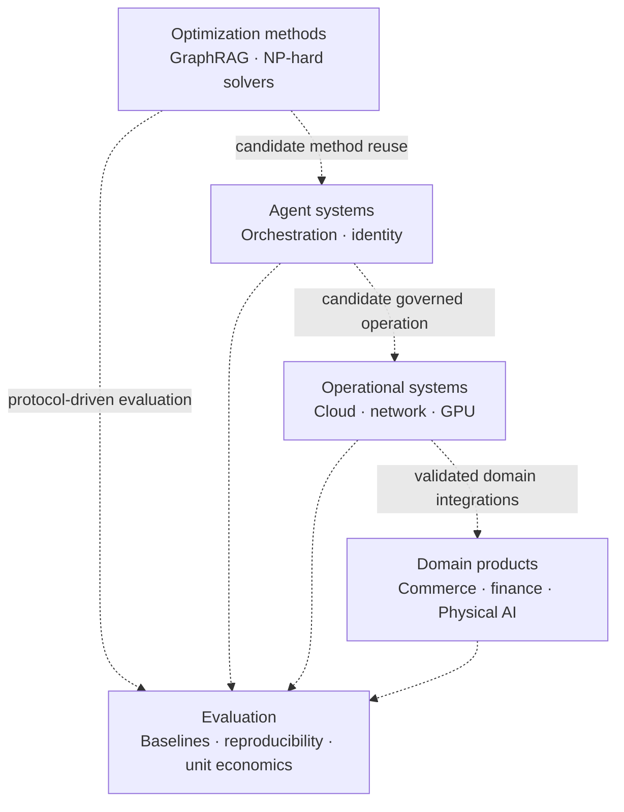
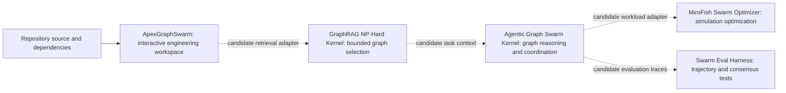
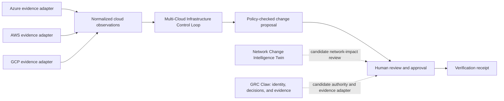
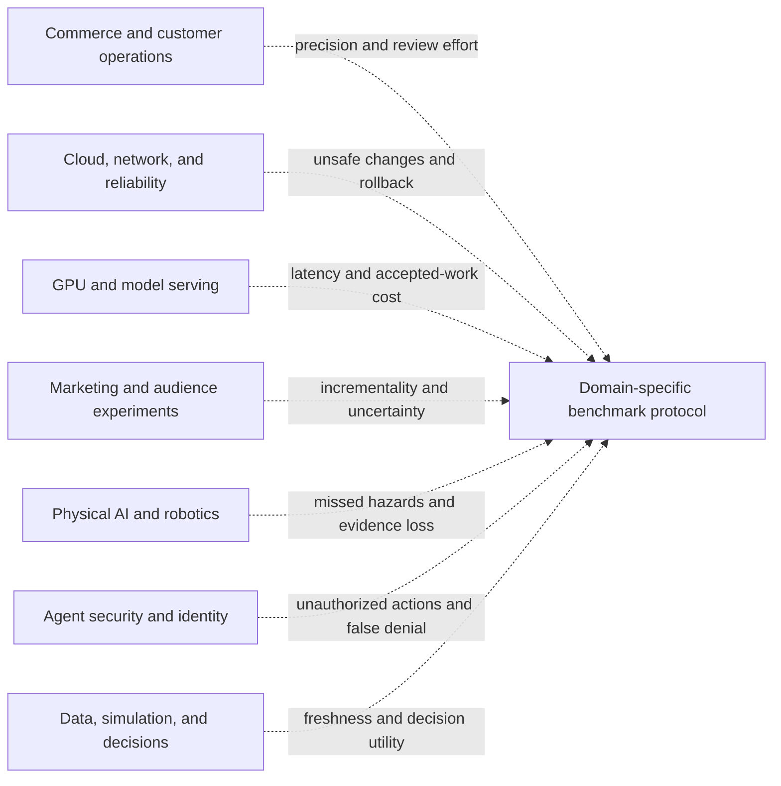

# Ahmed Hassan — Engineering reliable decision systems for complex operations

I build distinct software systems where combinatorial optimization meets operational reality: graph engineering and GraphRAG, agentic swarms and identity, cloud and network control, GPU/model economics, finance, low-latency systems and silicon acceleration, commerce, decision science, and physical AI. Each project keeps its own technical thesis, architecture, evaluation axes, limitations, and evidence boundary. Shared layers connect projects; they do not erase their individual identities.

**Current maintenance focus:** [GRC Claw](https://github.com/AAH20/GRC_Claw) · [Multi-Cloud Infrastructure Control Loop](https://github.com/AAH20/multicloud-infrastructure-control-loop) · [Network Change Intelligence Twin](https://github.com/AAH20/network-change-intelligence-twin). This names a bounded stewardship focus; it does not collapse the other domains or claim every repository is maintained at the same cadence.

[Sponsor the work](https://github.com/sponsors/AAH20) · [Maintenance record](MAINTENANCE.md) · [Sponsorship program and ten levels](SPONSORSHIP.md) · [Browse every public original repository](PORTFOLIO.md) · [Benchmark protocols](BENCHMARKS.md) · [Mentorship guide](MENTORSHIP.md) · [Portfolio data](data/portfolio-index.json) · [LinkedIn](https://www.linkedin.com/in/ahmed-hassan-f11/)

## Choose your path

| If you are here to… | Start with | Next step |
|---|---|---|
| Design agentic graph and swarm systems | [Apex Swarm Orchestrator Kernel](https://github.com/AAH20/apex-swarm-orchestrator-kernel) and [Apex MCP Gateway Kernel](https://github.com/AAH20/apex-mcp-gateway-kernel) | Compare each project’s own design and evaluation boundary; use the [benchmark protocols](BENCHMARKS.md) before comparing results. |
| Review operational controls and reliability | [Multi-Cloud Infrastructure Control Loop](https://github.com/AAH20/multicloud-infrastructure-control-loop) and [Network Change Intelligence Twin](https://github.com/AAH20/network-change-intelligence-twin) | Follow the evidence chain and stated mutation limits in each project README. |
| Evaluate low-latency systems and silicon acceleration | [Apex_ContractForge](https://github.com/AAH20/Apex_ContractForge), [Apex_ULL](https://github.com/AAH20/Apex_ULL), [Apex_Tick](https://github.com/AAH20/Apex_Tick), and [Apex_PerfAtlas](https://github.com/AAH20/Apex_PerfAtlas) | Inspect the [Apex ecosystem evidence and hardware gates](APEX_ECOSYSTEM.md), then reproduce the compiler qualification, host, or RTL-simulation evidence. |
| Learn, reproduce, or mentor | [GraphRAG NP-Hard Kernel](https://github.com/AAH20/graph-rag-np-hard-kernel) and [Swarm Eval Harness](https://github.com/AAH20/swarm-eval-harness) | Start with the [contributor and mentorship guide](MENTORSHIP.md), then reproduce a documented test or benchmark. |

This navigation shelf is not a maturity ranking. The [machine-readable portfolio index](data/portfolio-index.json) maps every public original repository to a portfolio pillar while leaving implementation assessment to each project’s evidence.

## What support sustains

The [live GitHub Sponsors page](https://github.com/sponsors/AAH20) offers nine monthly tiers from **$10 to $8,000**, each with a tier-specific welcome message. Levels 1–6 sustain public maintenance, reproducible tests, documentation, issue triage, and independently reported limitations for the three declared focus projects. Levels 7–9 can underwrite a named benchmark, integration, or program pilot from the separate project lanes only after scope, baseline, reviewer, capacity, and acceptance criteria are published. [The dated record](MAINTENANCE.md) shows the core maintenance baseline and records subsequent work. [The program terms](SPONSORSHIP.md) distinguish the core commitment, proof-gated pilots, and a tenth, **$20,000/month** strategic level arranged under a separate agreement because GitHub caps a monthly tier at $12,000. Attribution does not imply ring-fenced accounting; funding never buys benchmark results, a reference-list position, or control of technical conclusions.

## Project architecture

This portfolio is a set of independent projects organized around distinct engineering pillars. The diagram shows how the work can compose; it is **not** a claim that every repository is wired into one platform. Dotted links are candidate reuse or integration paths. Each repository retains its own implementation, benchmark, release cadence, and evidence.


```mermaid
flowchart TB
  Opt["Optimization methods<br/>GraphRAG · NP-hard solvers"]
  Agents["Agent systems<br/>Orchestration · identity"]
  Infra["Operational systems<br/>Cloud · network · GPU"]
  Domains["Domain products<br/>Commerce · finance · Physical AI"]
  Eval["Evaluation<br/>Baselines · reproducibility · unit economics"]
  Opt -. "candidate method reuse" .-> Agents
  Agents -. "candidate governed operation" .-> Infra
  Infra -. "validated domain integrations" .-> Domains
  Opt -. "protocol-driven evaluation" .-> Eval
  Agents -.-> Eval
  Infra -.-> Eval
  Domains -.-> Eval
```

### Graph and swarm engineering

The work separates repository understanding, graph selection, orchestration, and evaluation. Candidate links describe where adapters and shared workloads could connect these distinct projects; the diagram does not assert a unified runtime.


```mermaid
flowchart LR
  Repo["Repository source and dependencies"]
  View["ApexGraphSwarm: interactive engineering workspace"]
  Select["GraphRAG NP-Hard Kernel: bounded graph selection"]
  Coordinate["Agentic Graph Swarm Kernel: graph reasoning and coordination"]
  Simulate["MiroFish Swarm Optimizer: simulation optimization"]
  Evaluate["Swarm Eval Harness: trajectory and consensus tests"]
  Repo --> View
  View -. "candidate retrieval adapter" .-> Select
  Select -. "candidate task context" .-> Coordinate
  Coordinate -. "candidate workload adapter" .-> Simulate
  Coordinate -. "candidate evaluation traces" .-> Evaluate
```

The only solid edge represents the repository-understanding input to the ApexGraphSwarm workspace. The dotted edges are integration candidates, not shipped contracts. See the individual project theses below and each repository's own tests and limits.

### Cloud, network, and governed operations

The left path reflects the documented evidence adapter and control-loop relationship. Network change analysis and GRC Claw are separate systems; their dotted paths show potential reviewed integration points.


```mermaid
flowchart LR
  Azure["Azure evidence adapter"]
  AWS["AWS evidence adapter"]
  GCP["GCP evidence adapter"]
  Normalize["Normalized cloud observations"]
  Control["Multi-Cloud Infrastructure Control Loop"]
  Plan["Policy-checked change proposal"]
  Human["Human review and approval"]
  Verify["Verification receipt"]
  Network["Network Change Intelligence Twin"]
  GRC["GRC Claw: identity, decisions, and evidence"]
  Azure --> Normalize
  AWS --> Normalize
  GCP --> Normalize
  Normalize --> Control
  Control --> Plan
  Plan --> Human
  Human --> Verify
  Network -. "candidate network-impact review" .-> Human
  GRC -. "candidate authority and evidence adapter" .-> Human
```

The control loop creates reviewable proposals; this profile does not claim production mutation. The cloud evidence adapters produce normalized observations and review-gated synchronization plans for CISO Assistant, which remains the GRC system of record.

### Domain-specific systems and measurement

Projects in a domain keep their own workloads and acceptance criteria. The shared benchmark document defines measurement vocabulary; dotted links here mean “evaluate with an appropriate protocol,” not a common data pipeline or combined score.


```mermaid
flowchart LR
  Commerce["Commerce and customer operations"]
  Cloud["Cloud, network, and reliability"]
  GPU["GPU and model serving"]
  Marketing["Marketing and audience experiments"]
  Physical["Physical AI and robotics"]
  Agents["Agent security and identity"]
  Data["Data, simulation, and decisions"]
  Measure["Domain-specific benchmark protocol"]
  Commerce -. "precision and review effort" .-> Measure
  Cloud -. "unsafe changes and rollback" .-> Measure
  GPU -. "latency and accepted-work cost" .-> Measure
  Marketing -. "incrementality and uncertainty" .-> Measure
  Physical -. "missed hazards and evidence loss" .-> Measure
  Agents -. "unauthorized actions and false denial" .-> Measure
  Data -. "freshness and decision utility" .-> Measure
```

[Benchmark definitions and evidence requirements](BENCHMARKS.md) specify workloads, denominators, and limits. The full [public original-project directory](PORTFOLIO.md) is the catalog; this profile highlights engineering theses and proof boundaries rather than repository counts.

### Low-latency systems and silicon acceleration

These four projects form a dedicated engineering lane while retaining separate responsibilities and licenses. Apex_ContractForge generates and qualifies a frozen Tick-profile C++/RTL implementation with local counter SMT obligations and unsafe-mutation checks; Apex_ULL supplies host foundations and a native evidence emitter; Apex_Tick supplies a bounded synthetic-event RTL core and independent oracle; Apex_PerfAtlas checks retained run evidence and evaluates explicit hardware and cost scenarios. Their three file-based evidence interfaces are implemented. Physical FPGA adapters, exchange integrations, official STAC runs, and ASIC qualification remain separate release gates.



[Project boundaries, reproducible evidence, and partner evaluation](APEX_ECOSYSTEM.md) · [Editable Mermaid architecture](assets/profile/apex-ecosystem.mmd)

## Ten flagship systems

These ten projects retain their prioritized showcase identities within the [dated public-original inventory](data/public-original-repositories.json). “Flagship” means portfolio priority, not a verified performance ranking, production deployment, or certification. Each keeps its own technical thesis and evidence boundary.

| Project | Distinct problem and technical thesis |
|---|---|
| [Apex Swarm Orchestrator Kernel](https://github.com/AAH20/apex-swarm-orchestrator-kernel) | Hierarchical delegation, latency-aware graph clustering, specialist leader selection, quality-diversity evolution, and Byzantine quorum design for coordinated agent systems. |
| [Apex MCP Gateway Kernel](https://github.com/AAH20/apex-mcp-gateway-kernel) | MCP tool/schema selection, context and prefix-cache management, inference routing, and deadlock avoidance at the gateway boundary. |
| [Frontier AI Compiler Kernel](https://github.com/AAH20/frontier-ai-compiler-kernel) | Combinatorial scheduling and optimization across distributed training, GPU memory tiling, and compiler execution paths. |
| [Apex Infrastructure Kill-Switch Kernel](https://github.com/AAH20/apex-infrastructure-killswitch-kernel) | Modeling protection coordination and coupled datacenter power/compute constraints, with high-consequence control claims kept within each repo’s evidence limits. |
| [Gigawatt Ride-Through AMM Kernel](https://github.com/AAH20/gigawatt-ride-through-amm-kernel) | Joint energy-storage, grid ride-through, and compute-response optimization as a distinct energy-economics system. |
| [Apex Quant Whale Kernel](https://github.com/AAH20/apex-quant-whale-kernel) | Market-microstructure, order allocation, and execution-routing optimization; simulations do not establish live trading performance. |
| [Agentic FinTech Kernel](https://github.com/AAH20/agentic-fintech-kernel) | Agent authority, payment-rail workflows, and settlement invariants; provider connectivity and compliance status require project-specific verification. |
| [Autonomous Cyber Defense Kernel](https://github.com/AAH20/autonomous-cyber-defense-kernel) | Defensive attack-graph isolation, response prioritization, and patch-verification research; benchmark fixtures do not establish operational SOC outcomes. |
| [Humanoid Swarm Robotics Kernel](https://github.com/AAH20/humanoid-swarm-robotics-kernel) | Humanoid balance and manipulation constraints, multi-robot path planning, and fleet/logistics scheduling. |
| [Microsecond Kill-Chain DAG](https://github.com/AAH20/microsecond-kill-chain-dag) | Deterministic event sequencing and release-authorization logic for high-consequence response systems; timing claims remain tied to the repository’s declared test environment. |

The [full public original-project directory](PORTFOLIO.md) retains the rest of the portfolio by domain. The diagrams above show possible integration seams; dashed links are proposals, and no integration is implied unless a repository documents and tests it.

## Additional systems and individual project theses

The systems below preserve distinct problem statements, architectures, and release/evidence boundaries. Each link leads to the project's own documentation; this index summarizes scope and does not assert production readiness or measured performance.


### Graph engineering, GraphRAG, agentic reasoning, and swarm systems

| Project | Individual technical focus |
|---|---|
| [ApexGraphSwarm](https://github.com/AAH20/ApexGraphSwarm) | Local-first engineering workspace for repository intelligence, interactive code graphs, specialist-team design, bounded swarm orchestration, evaluation, and cost-aware delegation. Its README distinguishes working engineering foundations from planned or unconnected integrations. |
| [Agentic Graph Swarm Kernel](https://github.com/AAH20/agentic-graph-swarm-kernel) | Deterministic standard-library kernel focused on graph reasoning, causal inference, epistemic consensus, and swarm coordination. |
| [GraphRAG NP-Hard Kernel](https://github.com/AAH20/graph-rag-np-hard-kernel) | Algorithmic work on graph-engineering and GraphRAG bottlenecks such as structured retrieval, graph selection, and summarization under combinatorial constraints. |
| [Agentic NP-Hard Kernel](https://github.com/AAH20/agentic-np-hard-kernel) | Deterministic solver suite focused on the combinatorial decisions behind agent task allocation, tool choice, and coordination. |
| [MiroFish Swarm Optimizer](https://github.com/AAH20/mirofish-swarm-optimizer) | Optimization methods for swarm simulation workloads, keeping simulation-scale coordination as its own project. |
| [Swarm Eval Harness](https://github.com/AAH20/swarm-eval-harness) | Metamorphic and stress-testing workflows for multi-turn agent trajectories and swarm consensus behavior. |
| [Agent Telepathy Bus](https://github.com/AAH20/agent-telepathy-bus) | A dedicated communication and context-transfer substrate for agent processes, separate from higher-level orchestration. |
| [Temporal Hypergraph Synthesizer](https://github.com/AAH20/temporal-hypergraph-synthesizer) | Models and synthesizes higher-order relationships that change over time, rather than flattening interactions into static pairwise edges. |

### Domain-specific optimization kernels

| Project | Individual technical focus |
|---|---|
| [Hyperscale Data Center NP-Hard Kernel](https://github.com/AAH20/datacenter-np-hard-kernel) | Resource-placement and infrastructure optimization across data-center and cloud capacity constraints. |
| [Tier-1 ISP NP-Hard Kernel](https://github.com/AAH20/tier1-isp-np-hard-kernel) | Routing, traffic engineering, and backbone economics for large carrier networks. |
| [Geospatial NP-Hard Kernel](https://github.com/AAH20/geospatial-np-hard-kernel) | Geospatial siting, coverage, labeling, routing, and allocation problems. |
| [Consular NP-Hard Kernel](https://github.com/AAH20/consular-np-hard-kernel) | Appointment allocation, constrained routing, dossier/resource packing, and related consular workflow optimization. |
| [HFT Microstructure Kernel](https://github.com/AAH20/hft-microstructure-kernel) | Market-microstructure and order-matching simulation with explicit attention to execution constraints; simulation results are not live trading performance. |
| [Physical AI Governor](https://github.com/AAH20/physical-ai-governor) | Synthetic assurance testbed for physical-AI governance contracts, trajectory checks, and auditable safety evidence. |
| [Cross-Border PvP Kernel](https://github.com/AAH20/cross-border-pvp-kernel) | Payment-versus-payment workflow and allocation logic for cross-border settlement scenarios. |

### Agent authority, security, and operating platforms

| Project | Individual technical focus |
|---|---|
| [GRC Claw](https://github.com/AAH20/GRC_Claw) | Agent policy and evidence control plane that records identity, delegated authority, decisions, approvals, action receipts, control mappings, and provenance. |
| [AI Agent Identity and Authorization Security Lab](https://github.com/AAH20/ai-agent-identity-authorization-security) | Open conformance tests for agent identity, authorization, MCP permissions, delegated access, workload identity, and accountable actions. |
| [Agent JIT IAM](https://github.com/AAH20/agent-jit-iam) | Credentialless, workload-bound authorization that brokers narrowly scoped, time-bounded external operations without exposing reusable provider credentials to the agent. |
| [MCP Gateway Inference Router Kernel](https://github.com/AAH20/mcp-gateway-inference-router-kernel) | Gateway-side schema/context selection and inference routing under tool, latency, cache, and cost constraints. |
| [Enterprise MCP Firewall](https://github.com/AAH20/enterprise-mcp-firewall) | Security boundary for inspecting and governing MCP tool traffic. |
| [Play Anything](https://github.com/AAH20/play-anything) | Turns a code repository into an interactive, game-like exploration and learning experience while keeping code understanding as the core activity. |
| [M&A VDR Diligence OS](https://github.com/AAH20/ma-vdr-diligence-os) | Technical due-diligence workflows and evidence organization for M&A review. |
| [AIOps Observability Platform](https://github.com/AAH20/aiops-observability-platform) | Observability and incident-analysis tooling for correlating telemetry with operational decisions. |
| [AI Factory Revenue Twin](https://github.com/AAH20/ai-factory-revenue-twin) | Capacity and unit-economics modeling for GPU and AI-factory infrastructure. |

The [public original-project directory](PORTFOLIO.md) remains the broad catalog, including projects beyond these highlighted systems. Forks are identified separately in GitHub and are not presented here as original work. Use each repository’s own README, tests, benchmark protocol, and limitations to assess implementation depth.

## Selected implementations and evidence boundaries

| System | Painful business problem | Executable proof | Evidence boundary |
|---|---|---|---|
| [Commerce Incident Network](https://github.com/AAH20/commerce-incident-network) | Shopify and Google Merchant Center can disagree about product visibility, price, and availability | Offline two-snapshot demo, incident queue, local operator desk, and verifier | Fictional fixtures; read-only connectors tested with mocked responses; no live merchant account exercised |
| [Multi-Cloud Infrastructure Control Loop](https://github.com/AAH20/multicloud-infrastructure-control-loop) | Cloud findings rarely explain the safe change, financial impact or verification path | Five Azure/AWS/GCP/Kubernetes workflows, cost scenarios, blast-radius gates and verification receipts | Seven tests; synthetic fixtures; performs no production mutation |
| [Network Change Intelligence Twin](https://github.com/AAH20/network-change-intelligence-twin) | A network change can interrupt every dependent workload and revenue path | Intent validation, path analysis, dependency-failure replay, policy gates and revenue exposure | Implemented and simulated; Bicep compiled; no production device operated |
| [Kubernetes AI FinOps Autopilot](https://github.com/AAH20/kubernetes-ai-finops-autopilot) | GPU and inference workloads scale cost faster than successful business outcomes | Policy-qualified cost models, admissibility gates and reviewable GitOps proposals | Reproducible synthetic scenarios; no silent cluster mutation |
| [GRC Claw](https://github.com/AAH20/GRC_Claw) | Enterprises need governed agentic systems, not unbounded agents attached to sensitive tools | ISO 42001-oriented governance chassis, agent controls, MCP boundaries and compliance workflows | OSS implementation; framework mappings require organizational and auditor validation |

## Multi-cloud evidence and remediation suite

The control loop consumes normalized operational evidence from three independently testable cloud adapters:

- [Azure Compliance Automation](https://github.com/AAH20/ciso-assistant-azure-compliance-automation) — Azure Policy and Checkov/Terraform evidence.
- [AWS Compliance Automation](https://github.com/AAH20/ciso-assistant-aws-compliance-automation) — Security Hub, AWS Config and Checkov/Terraform evidence.
- [GCP Compliance Automation](https://github.com/AAH20/ciso-assistant-gcp-compliance-automation) — Security Command Center, Cloud Asset Inventory and Checkov/Terraform evidence.

Each adapter produces normalized control observations, SHA-256 integrity digests and review-gated CISO Assistant synchronization plans. CISO Assistant remains the GRC system of record; the adapters and control loop provide the technical collection, architecture decision and verification layers.

## How to evaluate the work

- **Low-latency/silicon:** exact workload and clock boundaries, correctness and loss accounting, reproducible host/RTL evidence, qualified hardware and scoped deployment costs.
- **Commerce:** adjudicated incident precision, review effort, correction observation, and contribution economics.
- **GPU/model serving:** latency and throughput at fixed quality, concurrency, model revision, and fully allocated cost.
- **Cloud/network:** unsafe-change escapes, blast-radius prediction, rollback verification, and recovery time.
- **Marketing:** incrementality and uncertainty under a declared experimental design.
- **Physical AI:** missed hazards, decision timing, recorder completeness, and safe failure in a specified environment.
- **Agent security/identity:** prohibited-action escapes, false denials, policy scope, and replayable traces.
- **Data/decisions:** data freshness, correctness, baseline utility, and outcome observation.

[See exact benchmark definitions and evidence requirements](BENCHMARKS.md).

## CISO and GRC expertise

I treat governance as an engineering feedback loop derived from deployed systems—not a spreadsheet layer separated from operations:

```text
Cloud, network, identity, application and SOC telemetry
                         ↓
           Normalized technical evidence
                         ↓
     Controls, risks, findings and audit workflows
                         ↓
   Terraform / OpenTofu / Bicep / Ansible proposal
                         ↓
         Human approval and controlled rollout
                         ↓
       Recollection and remediation verification
```

Relevant capabilities include:

- CISO Assistant integration and multi-cloud evidence collection;
- ISO 27001, ISO 42001, SOC 2, NIST, CIS, NIS2 and DORA mapping workflows;
- Microsoft Sentinel, Wazuh, OpenSearch and cloud-native SOC architectures;
- identity, segmentation, logging, detection engineering and incident evidence;
- audit readiness, evidence lifecycle, third-party risk and corrective-action tracking;
- agent authorization, MCP security and human-governed remediation.

Framework mappings and modeled outcomes are never presented as certification, legal advice or customer results without the corresponding review and evidence.

## Proof matrix

| Project | Automated proof | Live deployment claim | Synthetic evidence | Mutation boundary |
|---|---:|---|---|---|
| Multi-Cloud Infrastructure Control Loop | 7 tests | No | Yes | Offline; proposals only |
| Azure Compliance Bridge | 4 tests | No | Yes | Remote API sync requires explicit `--apply` |
| AWS Compliance Bridge | 5 tests | No | Yes | Remote API sync requires explicit `--apply` |
| GCP Compliance Bridge | 4 tests | No | Yes | Remote API sync requires explicit `--apply` |
| [Azure Private Link Doctor](https://github.com/AAH20/azure-private-link-doctor) | Reproducible scenario suite | No | Yes | Diagnostics and IaC scaffolds only |
| Kubernetes AI FinOps Autopilot | Reproducible scenario suite | No | Yes | Reviewable GitOps proposals only |

## Evidence standard

Every flagship separates four evidence classes:

- **Implemented** — executable code and automated tests exist.
- **Deployed** — retained evidence comes from an authorized cloud or infrastructure environment.
- **Simulated** — deterministic fixtures or synthetic telemetry exercise declared scenarios.
- **Contract** — an integration boundary is designed but has not called the real provider.

Modeled revenue, savings, latency, capacity and risk reduction are not presented as customer outcomes. SHA-256 receipts demonstrate integrity of serialized decisions; they do not provide non-repudiation without authenticated signing and evidence custody.

## Supporting platforms

- [Agentic DevOps & SRE Skill Registry](https://github.com/AAH20/agentic-devops-sre-skill-registry) — evaluated reusable skills for CloudOps, SRE, Kubernetes, networking and FinOps.
- [AI Factory Revenue Twin](https://github.com/AAH20/ai-factory-revenue-twin) — GPU, fabric, capacity and hybrid-cloud unit economics.
- [Enterprise AI Integration Platform](https://github.com/AAH20/enterprise-ai-integration-platform) — durable orchestration across CRM, ERP, payments, logistics and billing boundaries.
- [AI-Native Internal Developer Platform](https://github.com/AAH20/ai-native-internal-developer-platform) — Kubernetes, GitOps, golden paths and platform delivery economics.
- [AIOps Observability Platform](https://github.com/AAH20/aiops-observability-platform) — OpenTelemetry, root-cause analysis and incident automation.
- [Cloud Resilience & Disaster Recovery](https://github.com/AAH20/cloud-resilience-disaster-recovery-platform) — RTO/RPO, ransomware recovery and multi-region scenarios.

Post-quantum, healthcare, biometric, robotics, and domain-specific systems retain their own scope and evidence limits in the [full original-project directory](PORTFOLIO.md).

## Engagements

### Infrastructure and model-serving architecture

Cloud, network, Kubernetes, GPU serving and data topology; failure modes, capacity, rollback, security boundaries, operating KPIs, and unit economics.

### Identity, agent security, and governed operations

Authorization boundaries, agent-tool evaluation, SOC integration, control evidence, and reviewable remediation workflows.

### Commerce, marketing, and decision systems

Product and order-state diagnostics, causal measurement, customer-operation reliability, data freshness, and benchmark design tied to accepted business outcomes.

### Physical AI and high-consequence evaluation

Recorder completeness, missed-hazard evaluation, simulation-to-lab evidence boundaries, and safety-oriented test protocols.

For a scoped technical review, [contact me through A2Z SOC](https://a2zsoc.com/contact?topic=architecture-review&utm_source=github&utm_medium=profile). A2Z SOC is a separate services site; the repositories and benchmark specifications above are the open-source work.
