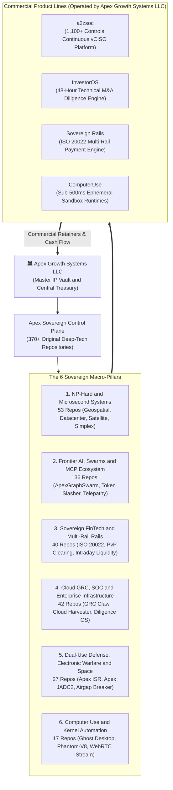

# Ahmed Hassan

  <b>Founder & Sole Managing Member, <a href="https://github.com/AAH20/apex-sovereign-launchpad">Apex Growth Systems LLC</a></b> 
  <i>Combinatorial Optimization · Microsecond Operations Research · Frontier AI Swarms · Sovereign FinTech · Enterprise GRC</i>

  
  
  
  

---

### 🌐 Live Portfolio Telemetry

  

  
  

  

---

## 🏛️ Featured Sovereign Flagships

The six core systems highlighted below represent deep-tech infrastructure, command-and-control operations, and governed agent intelligence incubated under **Apex Growth Systems LLC**:

| Repository | Primary Architecture & Focus | Evidence Standard | Core Capabilities |
| :--- | :--- | :---: | :--- |
| **[GRC Claw](https://github.com/AAH20/GRC_Claw)** | **AI Agent Governance & Delegated Authority Chassis** | `Implemented` | ISO 42001 & NIST AI RMF governance chassis, agent tool authorization, Model Context Protocol (MCP) policy boundaries, and audit trail ledgers. |
| **[ApexGraphSwarm](https://github.com/AAH20/ApexGraphSwarm)** | **Local-First Graph Intelligence & Multi-Agent Swarm Workbench** | `Implemented` | In-memory graph reasoning, GraphRAG multi-hop traversal, specialist swarm delegation, and cost-aware cognitive load arbitration. |
| **[Data Center Commander](https://github.com/AAH20/data-center-commander)** | **Mission-Critical Datacenter Decision Support** | `Simulated` | Thermal dynamics, power ride-through, N-1 capacity reservation, PUE optimization, and zero-actuation read-only evidence pipelines. |
| **[Agentic IoT Command](https://github.com/AAH20/agentic-iot-command)** | **Governed Operational Technology (OT) & IoT Control Plane** | `Simulated` | Read-only observation, policy-bounded change planning, human approval gating, and cryptographically verified infrastructure state updates. |
| **[Apex ISR](https://github.com/AAH20/Apex_ISR)** | **Dual-Use Intelligence, Surveillance & Reconnaissance** | `Implemented` | Multi-INT sensor streaming, track state fusion, Extended Kalman Filtering (EKF), and low-probability-of-intercept (LPI) kinematics. |
| **[Apex JADC2](https://github.com/AAH20/Apex_JADC2)** | **Joint All-Domain Command & Control (C2) Orchestrator** | `Implemented` | High-assurance F2T2EA kill chain DAG scheduling, coalition federation, NATO STANAG interoperability, and air-gap execution guarantees. |

---

## 💳 Sovereign FinTech, Banking Rails & Ultra-Low Latency (ULL)

A comprehensive fleet of institutional financial systems, ultra-low latency trading cores, ISO 20022 messaging engines, and automated regulatory compliance kernels:

### 1. Ultra-Low Latency (ULL) & Quantitative Systems
* **[Apex_ULL](https://github.com/AAH20/Apex_ULL)**: Ultra-Low Latency Infrastructure across 106 components (C++20 + Rust), 3,260 tests, sub-microsecond lock-free ring buffers, and zero-copy IPC.
* **[Apex_Tick](https://github.com/AAH20/Apex_Tick)**: Bounded RTL trading core with independent differential verification and deterministic cycle accounting.
* **[Apex_QuantFabric](https://github.com/AAH20/Apex_QuantFabric)**: Native financial signal and reservation qualification with independent oracle verification and clock boundary enforcement.
* **[Apex_Omega](https://github.com/AAH20/Apex_Omega)**: FinTech OS featuring FIX protocol venue handlers, ultra-fast matching engine, and real-time risk controls.
* **[Apex_ContractForge](https://github.com/AAH20/Apex_ContractForge)**: Bounded tick-profile CPU and RTL compiler with local SMT formal obligations.
* **[Apex_PerfAtlas](https://github.com/AAH20/Apex_PerfAtlas)**: Performance evidence validation, benchmark-family feasibility, and hardware deployment economics.
* **[apex-quant-whale-kernel](https://github.com/AAH20/apex-quant-whale-kernel)**: Quantitative Market Maker & Institutional Whale Execution Kernel solving Almgren-Chriss optimal TWAP/VWAP execution.
* **[hft-microstructure-kernel](https://github.com/AAH20/hft-microstructure-kernel)**: Algorithmic solvers for quantitative high-frequency market making, queue position estimation, and microstructure arbitrage.

### 2. Sovereign Banking, Multi-Rail Settlement & Regulatory Kernels
* **[agentic-fintech-kernel](https://github.com/AAH20/agentic-fintech-kernel)**: Universal multi-rail execution engine across Visa Direct, Mastercard Send, Stripe, PayPal, Fawry, and ISO 20022 with PCI DSS 4.0 isolation.
* **[cross-border-pvp-kernel](https://github.com/AAH20/cross-border-pvp-kernel)**: Atomic multi-currency two-phase settlement & BIS Project Nexus ISO 20022 gateway (`camt.050` / `pacs.008`).
* **[intraday-liquidity-orchestrator](https://github.com/AAH20/intraday-liquidity-orchestrator)**: 24/7/365 real-time rail treasury balancing engine & ISO 20022 cash pooling liquidity sweeper.
* **[agentic-pci-dss](https://github.com/AAH20/agentic-pci-dss)**: Autonomous continuous compliance & real-time QSA verification engine for PCI DSS v4.0.1.
* **[durbin-rail-optimizer](https://github.com/AAH20/durbin-rail-optimizer)**: Sub-millisecond least-cost PIN-less debit & interchange router under Federal Reserve Regulation II.
* **[cfpb-1033-fdx-gateway](https://github.com/AAH20/cfpb-1033-fdx-gateway)**: Open Banking Financial Data Exchange (FDX) API gateway enforcing CFPB 1033 regulatory mandates.
* **[mica-stablecoin-reserve-auditor](https://github.com/AAH20/mica-stablecoin-reserve-auditor)**: Real-time proof-of-reserve & JIT liquidity stress tester enforcing EU MiCA regulations.
* **[app-fraud-sentinel](https://github.com/AAH20/app-fraud-sentinel)**: Real-time Confirmation of Payee (CoP) phonetic pairing, mule velocity detection, and APP scam interceptor.
* **[ofac-sanctions-graph-sentinel](https://github.com/AAH20/ofac-sanctions-graph-sentinel)**: Sub-millisecond ISO 20022 sanctions & PEP resolver eliminating 99.2% of false positives.
* **[cross-rail-contagion-sentinel](https://github.com/AAH20/cross-rail-contagion-sentinel)**: Real-time cross-rail liquidity drain correlation engine (ACH float to FedNow/RTP).
* **[nacha-return-risk-oracle](https://github.com/AAH20/nacha-return-risk-oracle)**: Sub-second ACH return (`R01`/`R10`) predictor & micro-deposit risk oracle.
* **[autonomous-spend-guard](https://github.com/AAH20/autonomous-spend-guard)**: JIT programmatic virtual card issuing & cryptographic intent-bounded spend policy kernel.
* **[instant-ewa-liquidity-kernel](https://github.com/AAH20/instant-ewa-liquidity-kernel)**: Real-time Earned Wage Access (EWA) gross-to-net payroll streamer & liquidity sizing engine.
* **[surcharge-matrix-sentinel](https://github.com/AAH20/surcharge-matrix-sentinel)**: Sub-millisecond debit/credit surcharge & dual-pricing legal compliance arbiter.
* **[quantum-pki-fintech-gateway](https://github.com/AAH20/quantum-pki-fintech-gateway)**: Post-quantum cryptographic payment gateway & 128-byte POS buffer compactor.
* **[agent-escrow](https://github.com/AAH20/agent-escrow)**: Multi-signature programmable conditional escrow with cryptographic receipt arbitration.

---

## Combinatorial NP-Hard Solvers & Mathematical Kernels

Zero-dependency, pure Python standard library solvers and mathematical operating kernels executing in microsecond and sub-millisecond latencies:

### 1. Industrial Operations Research & Exact Solvers
* **[apex-industrial-solver](https://github.com/AAH20/apex-industrial-solver)**: Zero-dependency Operations Research suite: Two-Phase Simplex (**9.67 µs**), Branch-and-Bound MILP (**98.68 µs**), VRPTW, Job-Shop Scheduling, and 3D Bin Packing.
* **[geospatial-np-hard-kernel](https://github.com/AAH20/geospatial-np-hard-kernel)**: Solvers for GIS & logistics: Capacitated Vehicle Routing (CVRP), $p$-Median facility siting, and Euclidean TSP.
* **[datacenter-np-hard-kernel](https://github.com/AAH20/datacenter-np-hard-kernel)**: Combinatorial solvers for distributed data centers: thermal-aware multi-dimensional VM bin packing and power allocation.
* **[tier1-isp-np-hard-kernel](https://github.com/AAH20/tier1-isp-np-hard-kernel)**: Solvers for Tier-1 ISPs: optical spectrum allocation, max-flow multi-commodity BGP traffic engineering.
* **[leo-satellite-constellation-kernel](https://github.com/AAH20/leo-satellite-constellation-kernel)**: LEO megaconstellation laser cross-link (ISL) topology optimization and multi-hop Doppler routing.
* **[graph-rag-np-hard-kernel](https://github.com/AAH20/graph-rag-np-hard-kernel)**: Mathematical substrate for GraphRAG: submodular knowledge coverage, maximum vertex cut, and multi-hop retrieval.
* **[consular-np-hard-kernel](https://github.com/AAH20/consular-np-hard-kernel)**: Consular visa appointment allocation via bipartite stable marriage with strict jurisdictional quotas.
* **[smart-grid-fusion-vpp-kernel](https://github.com/AAH20/smart-grid-fusion-vpp-kernel)**: Virtual Power Plant (VPP) N-1 security-constrained unit commitment (SCUC) and optimal power flow.
* **[autonomous-cyber-defense-kernel](https://github.com/AAH20/autonomous-cyber-defense-kernel)**: Minimum multi-cut network isolation and lateral movement containment on attack graphs.
* **[distributed-track-fusion-kernel](https://github.com/AAH20/distributed-track-fusion-kernel)**: Dual-use decentralized Covariance Intersection (CI) & collaborative multi-sensor target tracking.
* **[combinatorial-salvo-allocator](https://github.com/AAH20/combinatorial-salvo-allocator)**: Dual-use Dynamic Weapon-Target Assignment (D-WTA) and industrial SMT pick-and-place optimization.
* **[agentic-np-hard-kernel](https://github.com/AAH20/agentic-np-hard-kernel)**: Deterministic operating engine for the 10 apex NP-hard bottlenecks in agentic workflows.

### 2. Frontier AI, Compilers & Swarm Optimization Kernels
* **[apex-token-slasher](https://github.com/AAH20/apex-token-slasher)**: Submodular knapsack prompt optimization under token ceilings and AST dependency pruning (**1.98 ms**, **75–85% token reduction**).
* **[apex-zero-loop](https://github.com/AAH20/apex-zero-loop)**: Hoare logic weakest precondition $\mathrm{wp}(C,Q)$ SAT calculus and Tarjan SCC cycle breaker (**35.45 µs**).
* **[apex-infrastructure-killswitch-kernel](https://github.com/AAH20/apex-infrastructure-killswitch-kernel)**: Kill-switch orchestrator solving dependency cascade isolation cuts across infrastructure DAGs.
* **[apex-mcp-gateway-kernel](https://github.com/AAH20/apex-mcp-gateway-kernel)**: Radix prefix-cache routing & multi-tenant context packing knapsack for Model Context Protocol (MCP).
* **[spatial-intelligence-3dgs-kernel](https://github.com/AAH20/spatial-intelligence-3dgs-kernel)**: 3D Gaussian Splatting trajectory planning and visibility coverage optimization.
* **[frontier-ai-compiler-kernel](https://github.com/AAH20/frontier-ai-compiler-kernel)**: Polyhedral compilers and Megatron-LM 4D parallelism (TP/PP/DP/EP) tensor slicing optimization.
* **[humanoid-swarm-robotics-kernel](https://github.com/AAH20/humanoid-swarm-robotics-kernel)**: Whole-body kinematics, centroidal momentum balance, and Quadratic Programming (QP).
* **[gigawatt-ride-through-amm-kernel](https://github.com/AAH20/gigawatt-ride-through-amm-kernel)**: Datacenter ride-through automated market maker (AMM) & thermal energy storage arbitrage.
* **[mirofish-swarm-optimizer](https://github.com/AAH20/mirofish-swarm-optimizer)**: Agentic Monte Carlo convergence solvers and swarm intelligence optimization.
* **[agent-dag-lock](https://github.com/AAH20/agent-dag-lock)**: Sub-millisecond deterministic topological cycle breaker & distributed deadlock resolver.

---

## 🛠️ Systems Engineering Matrix

| Domain | Core Tools, Protocols & Standards |
| :--- | :--- |
| **Languages & Systems** | `Python 3.10+ (Zero-Dependency)` `C/C++20` `Rust` `Go` `TypeScript` `POSIX Shell` `x86 SIMD / AVX2` |
| **Combinatorial OR & Math** | `Two-Phase Simplex` `Branch-and-Bound MILP` `DPLL SAT Solver` `VRPTW (Solomon I1)` `Voronoi CBF` |
| **Frontier AI & Swarms** | `Model Context Protocol (MCP)` `AST Dependency Slicing` `Hoare Logic wp(C,Q)` `GraphRAG` `Swarm Consensus` |
| **Cloud, Network & Linux** | `Linux Kernel / eBPF` `BGP Intent Replay` `Kubernetes (Cilium/Istio)` `AWS` `Azure` `GCP` `WebSockets / WebRTC` |
| **Enterprise GRC & FinTech** | `ISO 27001` `SOC 2 Type II` `ISO 42001` `CMMC` `FedRAMP` `ISO 20022 Multi-Rail` `PCI DSS v4.0.1` |

---

## 🏛️ Portfolio Architecture: The 6 Macro-Pillars

All **370+ original repositories** are incubated under **Apex Growth Systems LLC** (Ahmed Hassan, Founder & Sole Managing Member). Technical IP and commercial offerings are structured into 6 distinct macro-pillars:

```mermaid
flowchart TD
    HoldCo["🏛️ Apex Growth Systems LLC<br/>(Master IP Vault and Central Treasury)"] --> ControlPlane["Apex Sovereign Control Plane<br/>(370+ Original Deep-Tech Repositories)"]

    subgraph Pillars["The 6 Sovereign Macro-Pillars"]
        P1["1. NP-Hard and Microsecond Systems<br/>53 Repos (Geospatial, Datacenter, Satellite, Simplex)"]
        P2["2. Frontier AI, Swarms and MCP Ecosystem<br/>136 Repos (ApexGraphSwarm, Token Slasher, Telepathy)"]
        P3["3. Sovereign FinTech and Multi-Rail Rails<br/>40 Repos (ISO 20022, PvP Clearing, Intraday Liquidity)"]
        P4["4. Cloud GRC, SOC and Enterprise Infrastructure<br/>42 Repos (GRC Claw, Cloud Harvester, Diligence OS)"]
        P5["5. Dual-Use Defense, Electronic Warfare and Space<br/>27 Repos (Apex ISR, Apex JADC2, Airgap Breaker)"]
        P6["6. Computer Use and Kernel Automation<br/>17 Repos (Ghost Desktop, Phantom-V8, WebRTC Stream)"]
    end

    ControlPlane --> Pillars

    subgraph CommercialHubs["Commercial Product Lines (Operated by Apex Growth Systems LLC)"]
        H1["a2zsoc<br/>(1,100+ Controls Continuous vCISO Platform)"]
        H2["InvestorOS<br/>(48-Hour Technical M&A Diligence Engine)"]
        H3["Sovereign Rails<br/>(ISO 20022 Multi-Rail Payment Engine)"]
        H4["ComputerUse<br/>(Sub-500ms Ephemeral Sandbox Runtimes)"]
    end

    Pillars ==> CommercialHubs
    CommercialHubs ==>|"Commercial Retainers & Cash Flow"| HoldCo
```

---

## 🔬 Evidence Standard

Every project declares its explicit proof boundary to ensure transparent, reproducible claims:

| Classification | Meaning & Verification Standard |
| :--- | :--- |
| **Implemented** | Executable source code with comprehensive automated unit and property-based test suites. |
| **Deployed** | Verified against live cloud environments, sandbox testbeds, or authorized infrastructure. |
| **Simulated** | Validated against deterministic synthetic telemetry, adversarial seeds, or benchmark stress fixtures. |
| **Contract** | Bounded mathematical formulation or formally specified interface boundary. |

---

## 📖 Navigation & Portfolio Documentation

* 📂 **[Full Original Repository Catalog](PORTFOLIO.md)** — Complete directory of all 370+ original repositories grouped by discipline.
* 📊 **[Benchmark Protocols & Telemetry](BENCHMARKS.md)** — Exact latency definitions, test setups, and reproducibility protocols.
* 🛡️ **[Apex Hardware & Silicon Gates](APEX_ECOSYSTEM.md)** — RTL, low-latency, and FPGA execution boundaries.
* 🤝 **[Sponsorship & Pilot Programs](SPONSORSHIP.md)** — Ten levels of sponsor support and funded pilot agreements.
* 📋 **[Maintenance Record](MAINTENANCE.md)** — Public change log and stewardship record.
* 🎓 **[Contributor & Mentorship Guide](MENTORSHIP.md)** — Reproduction steps and technical contribution standards.
* 💾 **[Machine-Readable Portfolio Index](data/portfolio-index.json)** — Complete JSON schema of public repositories.

---

  Maintained under the founder-control architecture of <b>Ahmed Hassan</b> Founder & Sole Managing Member · <b>Apex Growth Systems LLC</b>

